# 🎈 Modern & Dreamy Birthday Template 

Apne special bestie, partner ya sibling ke liye ek cinematic, highly interactive birthday celebration website banayein — **Bina kisi coding ke!** 

Aapko code seekhne ya files me edits dhoondhne ki bilkul zaroorat nahi hai. Hum code edit karne ke liye humare smart AI coding assistant (**Antigravity**) ka use karenge! Aap bas instructions flow follow kijiye:

---

## 🚀 Step-by-Step Guide for Absolute Beginners

### 🛠️ Step 1: GitHub Repo Fork & Clone Karein

Sabse pehle aapko is template ko apne GitHub account me copy karna hoga aur fir use system me open karna hoga:

1. **GitHub repository ko Fork karein:** Target GitHub page ke top-right corner par jayein aur **Fork** button click karein:
   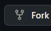
   Isse ye repository automatically aapke personal GitHub account me copy ho jayegi.
2. **Repository URL link copy karein:** Fork hone ke baad, apne account par redirect hone ke baad green **Code** button click karein aur HTTPS web clone URL (link) ko copy kar lein.
3. **Antigravity / Cursor me open karein:** Apne computer par **Antigravity / Cursor** editor ko open kijiye, aur iske terminal me copied link se repository clone execute kijiye:

```bash
# 1. Project directory clone karein (Apni copied URL ka use karein)
git clone https://github.com/YOUR-USERNAME/birthday-template.git

# 2. Project folder me enter karein
cd birthday-template

# 3. Dependencies install karein
npm i

# 4. Local dev site start karein
npm run dev
```

> 💡 **Node.js or Installation Errors?**  
> Agar aapke computer me **Node.js download nahi hai** ya commands run karte time koi bhi error (jaise name resolutions, missing dependencies, variables issues) aaye, toh bas terminal/chat me **Antigravity agent se kahein**:  
> *"Hey Antigravity, please download Node.js and fix all command execution errors."*  
> AI agent auto-download, local node path setup, aur initialization khud he kar dega!

---

### 🎨 Step 2: Screen Preview & AI Auto-Customization
Jaise he `npm run dev` start ho jaye, localhost URL copy karke browser me website preview open karein. 

**Ab customise karne ke liye:**
1. Website par jis section ko aap change karna chahte hain (jaise: Name introduction card, slideshow details, story chapters, or music video player), us component ki **website preview screenshot** lein.
2. Us screenshot ko **Antigravity / Cursor** chat widget me paste/attach karein.
3. AI Agent ko simple language me instructions dein:
   - *"Hey Antigravity, please replace the name in this landing page screenshot with my friend 'Rohit'."*
   - *"Please swap the playlist video ID of background audio to link my favorite track: [YouTube Video ID]."*
   - *"Please change this story section details according to the text in this image..."*

Humara system configuration (centralized variables `src/config/birthdayData.ts` database system) itna fast and organized hai ki AI automatic locations trace karke files instantly update kar dega!

---

## 📸 Visual Customization Guide

Diye gaye templates me sections ko badalne ki guide:

### 1. Main Hero Image Slider (Home Page)
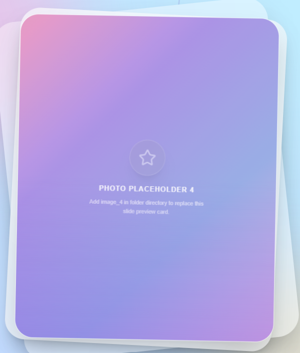

**Yahan par jiske birthday hai, uski cute si photo lagayein!** ✨
* **Description:** Website ke main landing page par rotating image slider hai jisme aap unki sabse cute ya beautiful photos toggle kar sakte hain.
* **How to edit:** Apne images ko clone directory me add karein aur Antigravity se kahein: *"Hey Antigravity, please replace the hero image slider with my uploaded pictures"* or manual configurations `birthdayData.ts` me file import karke edit kar sakte hain.

---

### 2. Welcome Intro Text (Home Page)
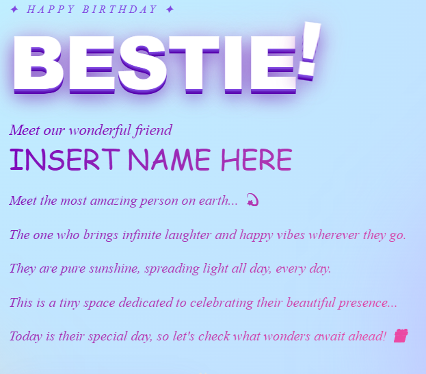

**Yahan par aap apne bestie ya cutie ke liye ek pyara sa message likhein!** ✍️
* **Description:** Landing page ka main welcome text introduction. Yahan aap unki dher saari tareef kar sakte hain, sweet lines likh sakte hain, ya phir unhe thoda bohot tease/tang karne ke liye funny inside jokes daal sakte hain!
* **How to edit:** Antigravity se terminal chat me plain words me boleya: *"Hey Antigravity, custom modify main intro text: change name to Kabir and add a funny greeting card wishing him happy birthday"* or edit the `hero.introParas` text array in `birthdayData.ts` manually.

---

### 3. First Meeting Spot Story (Journey Page)
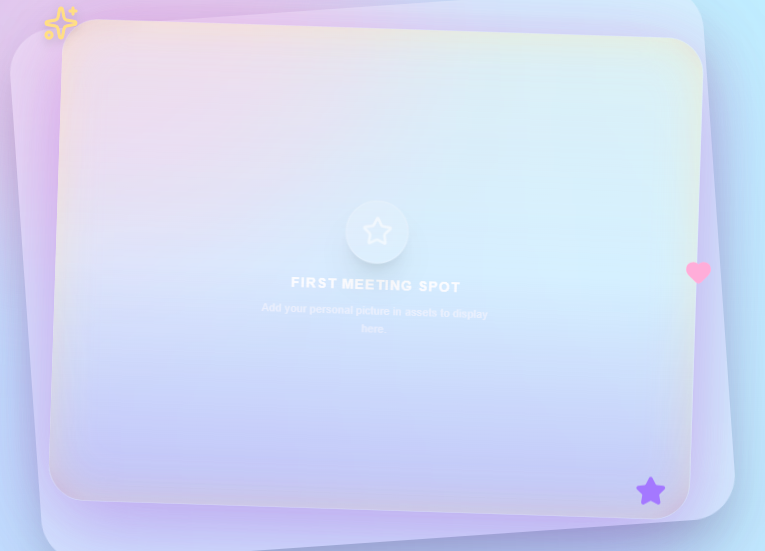

**Yahan par aap apne first meeting spot ya kisi special place ki story share karein!** 🗺️
* **Description:** Journey timeline ka pehla story block jahan aap apni mulaqat ki sweet details, first impression text, ya kisi specific special memory place ko document kar sakte hain.
* **How to edit:** Antigravity chat widget me explain karein: *"Hey Antigravity, edit first story block: set imageAlt to 'Cafe Coffee Day' and change lines to describe how we first met there by accident"* or edit the first story item in `journey.storyBlocks` in `birthdayData.ts` in the workspace.

---

### 4. Journey Story Lines Description (Journey Page)
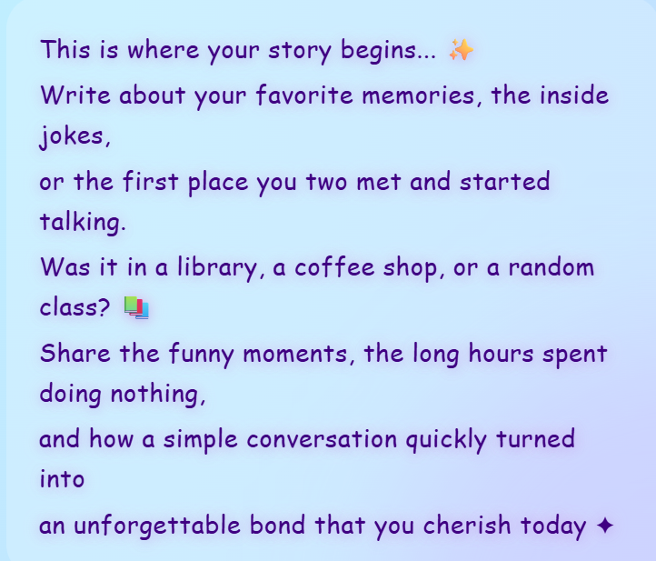

**Yahan par aap apne meeting spot ya apni kisi bhi favorite place ki custom memory description likhein, jo bhi aapka dil chahe!** 📖
* **Description:** Kahani timeline ke pehle story block ka detailed narrative text. Yahan aap us jagah ka mahol, wahan par aapki hui chats aur dher saari purani baatein paragraph forms me print kar sakte hain.
* **How to edit:** Antigravity chat screen par brief karein: *"Hey Antigravity, update first story block text description to write a sweet short paragraph about how we used to spend hours sitting and sharing memes"* or change the array layout values inside `journey.storyBlocks[0].lines` inside `birthdayData.ts` manually.

---

### 5. Adventures Memory Card (Journey Page)
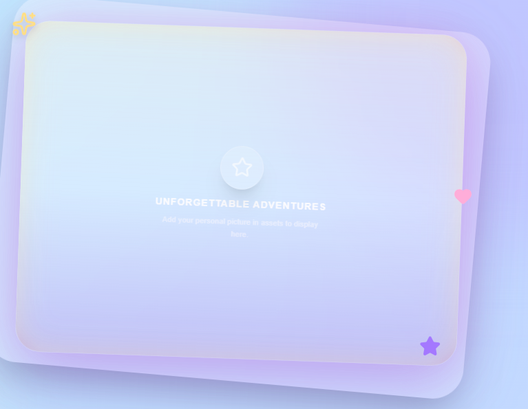

**Yahan aap dono ki koi bahut chatpati (fun) ya unforgettable pic lagayein, jo aapke liye sabse memorable ho!** 📸
* **Description:** Journey timeline ka dusra main card block jo aapki adventures, road trips, random outings, ya koi quirky fun moments represent karta hai. Yahan aap apni pasandida photo embed kar sakte hain.
* **How to edit:** Antigravity chat screen par specify karein: *"Hey Antigravity, replace the second story block image with my holiday trip group photo"* or update the image path for the second item in `journey.storyBlocks[1].image` config array inside `birthdayData.ts` manually.

---

### 6. Adventures Story Description (Journey Page)
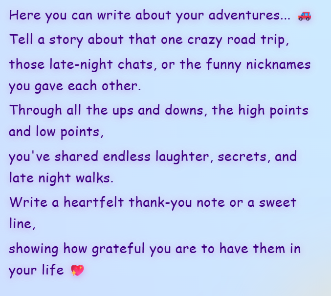

**Yahan par aap apni memories aur apni feelings ko khulkar express kar sakte hain!** 💖
* **Description:** Kahani timeline ke dusre story block ka paragraph text segment. Yahan aap unhe ek sweet thank-you note likh sakte hain, batayein ki wo aapke liye kitne special hain, aur unke future ke liye pyare message likhein.
* **How to edit:** Antigravity chat me instructions dein: *"Hey Antigravity, rewrite the text inside the second story paragraph to make it a deep, emotional thank-you paragraph expressing how grateful I am for their friendship"* or change the text array value inside `journey.storyBlocks[1].lines` inside `birthdayData.ts` manually.

---

### 7. Polaroid Photo Grid Gallery (Gallery Page)
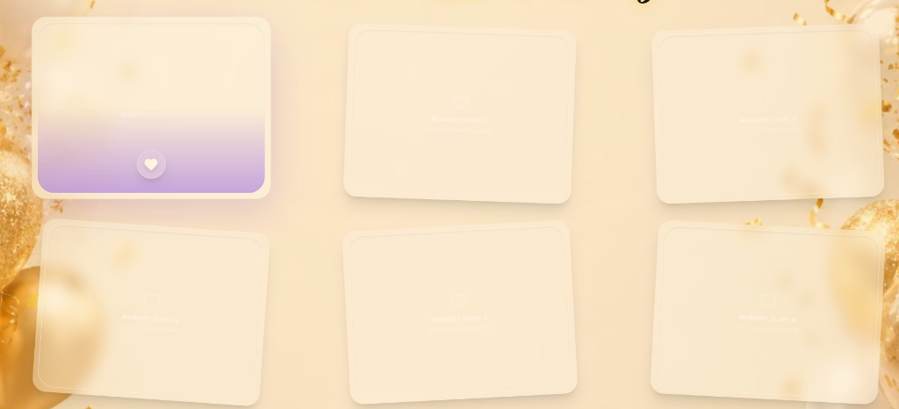

**Yahan par aap dono ki sabse pyaari aur memorable photos lagayein!** 🖼️
* **Description:** Grid segment jisme 6 floating polaroid photos render ho rahi hain. Custom image settings ke saath inka dynamic hover effect aur background support responsive aur alive dikta hai.
* **How to edit:** Antigravity chat console me clear instuctions dein: *"Hey Antigravity, connect my uploaded pictures to these 6 polaroid slots in the gallery page"* or update parameters under `gallery.images` config inside `birthdayData.ts` for quick placeholder naming, and hook actual assets using local files mapping.

---

### 8. Background Music Player (Floating Player)
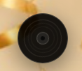

**Yeh floating music, player button hai. Isme aap dono ka favorite song laga sakte hain jo aapne saath suna ho, ya saamne vaale (birthday person) ka koi favourite tune!** 🎵
* **Description:** Website ke footer corner par ek premium custom-grooved spinning cd design jo click karne pe background media stream (Youtube player output) ko play/pause karta hai. **(💡 Tip: Aap is music player circle disk ke center me unki ya apni koi cute face photo bhi lagwa sakte hain jo gol-gol spin karegi!)**
* **How to edit:** Antigravity chat board me simple input karein: *"Hey Antigravity, change background music video ID to: [Copied YouTube Video ID] and put my uploaded photo in the center of the spinning vinyl record"* or update the `gallery.youtubeMusicId` text variable setting inside `birthdayData.ts` manually.

---

### 9. Finale Heartfelt Message & Poetry (Finale Page)
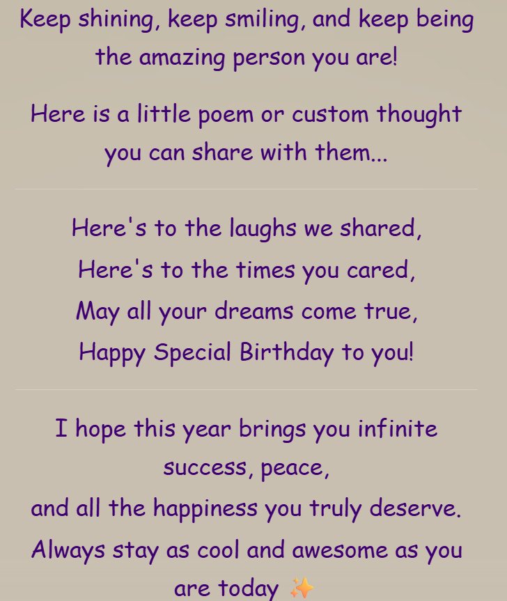

**Yahan aap apna final emotional birthday message, cute poems ya shayari, aur positive wishes likh sakte hain!** 💌
* **Description:** Finale page ka central wishes structure. Yeh section teen components me divided hai: main greeting lines, custom double-spaced poems/lyrics block, aur bullet wishes list.
* **How to edit:** Antigravity chat box me simple terms me bolyea: *"Hey Antigravity, update my finale wishes: write a sweet greeting letter, add 4 lines of matching poetry, and write down 2 funny wishes"* or customize the parameters inside `finale.letterParagraphs`, `finale.poem` and `finale.wishes` config values inside `birthdayData.ts` manually.

---

### 10. Final Memory Block Card (Finale Page)
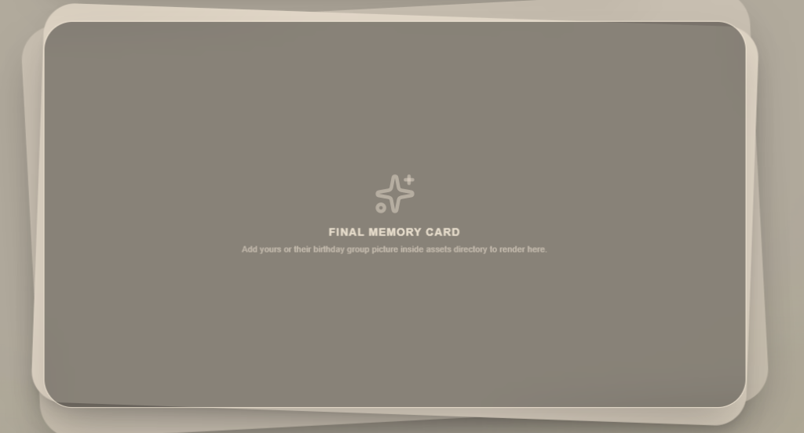

**Yahan par aap dono ki sabse best picture/photo, ya jo bhi surprise image aap lagana chahein, use lagayein!** ✨
* **Description:** Website ke sabse final ending segment ka big polaroid card placeholder. Yeh photo scroll complete ho jaane par surface hoti hai, jo ki surprise closing element ki tarah act karti hai.
* **How to edit:** Antigravity chat console me input karein: *"Hey Antigravity, replace the finale card background photo with my uploaded picture"* or edit the files mapping and paths inside the workspace.

---

### 11. Creator Badge & Footer Text (Finale Page)
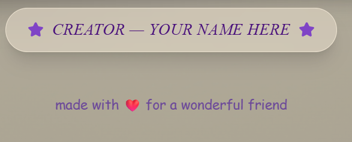

**Apna name (ya cute credit) aur dedication/footer details customize karein!** 🌸
* **Description:** Website ke aakhiri page (Finale Page) par bottom me ek stylish creator badge aur credit text hai. Jaise: `CREATOR — YOUR NAME HERE` aur `made with ❤️ for a wonderful friend`.
* **Creative Ideas:**
  * Aap aur cute banane ke liye `YOUR NAME HERE` ki jagah: **YOUR LOVE**, **YOUR HG/HB**, **YOUR BF/GF**, ya apna actual name bhi likh sakte hain.
  * Aur `made with ❤️ for` ke aage **"a wonderful friend"**, **"my favorite person"**, **"my heartbeat"** ya jo bhi line aapko sahi lage vo customize kar sakte hain!
* **How to edit:** Antigravity chat box me direction dein:
  * *"Hey Antigravity, change the creator badge and footer to show 'YOUR LOVE' and 'made with ❤️ for my favorite person'."*
  * Manually edit karne ke liye, `src/config/birthdayData.ts` me `finale.creatorName` aur `finale.footerText` properties ko change kar sakte hain:
    ```typescript
    creatorName: "YOUR LOVE", // e.g., "YOUR NAME", "YOUR LOVE", or "YOUR HG/HB"
    footerText: "made with ❤️ for my favorite person", // Apni pasand ka dedicated message
    ```

---

## ⚡ Step 3: Deployment (Website Live Kaise Karein?)

Jab aapki website customization complete ho jaye, toh ise net par live karne ke liye ye simple steps follow karein:

1. **Antigravity Se Commit Karwayein:** Sabse pehle ChatGPT ya Cursor/Antigravity chat widget me AI coding assistant ko bol dein ki saare changes commit kar de. AI automatic aapke saare changes save aur commit kar dega.
2. **YouTube Video Dekhlein:** Agar aapko hosting me koi confusion hai, toh YouTube par koi bhi simple video search karke dekh sakte hain: *"How to deploy website on Vercel"* ya *"Vercel par site kaise live karein"*.
3. **Vercel Par Deploy Karein:** YouTube video ko refer karke **[Vercel](https://vercel.com/)** par free account banayein, aur apni GitHub repo link karke deploy button click karein.
4. **Website Link Mil Jayegi:** Jaise hi hosting complete hogi, Vercel aapko ek working **live website link** dega.
5. **Website Complete!:** Bas! Aapki website complete ho gayi hai. Ab aap is link ko kisi ko bhi directly bhej sakte hain aur celebrate kar sakte hain! ❤️
